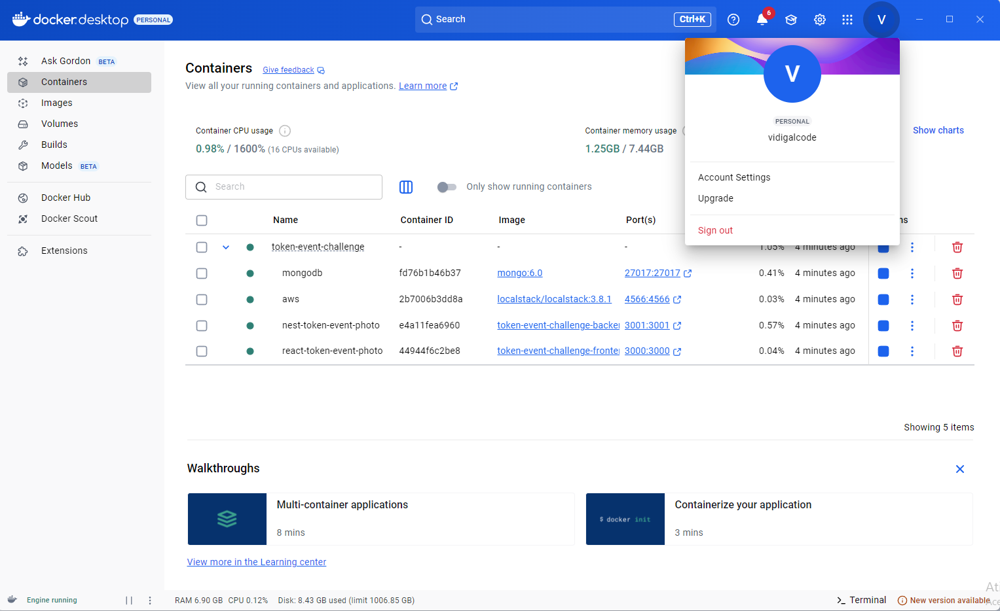

# Interactive Photo Booth (React + NestJS)


An interactive and secure photo booth application developed for events. It allows participants to take photos, apply a custom frame, and download them via a QR code. The project includes a complete backend with robust security features and an administrative panel for photo management.


<details>
<summary><strong>🇬🇧 English Description</strong></summary>

### 📜 About the Project

This project simulates an interactive photo activation for an event booth. The participant interacts with a screen, takes a photo, sees the result with a client's frame, and, upon approval, can download the image via a QR Code. The experience is designed to be fast, intuitive, and continuous.

The system is composed of:
- **Frontend (React)**: An interactive interface for the photo capture flow.
- **Backend (NestJS)**: A secure API for user authentication, image processing, and data persistence.
- **Database (MongoDB)**: Stores image metadata and user information.
- **File Storage (AWS S3 / LocalStack)**: Stores the generated photos.

### ✨ Key Features

#### User Experience
- **Interactive Flow**: A step-by-step process: Start -> Webcam Preview -> Countdown -> Capture -> Review -> Final QR Code.
- **Automatic Framing**: Automatically applies a predefined brand frame to each photo.
- **QR Code Download**: Generates a unique QR code for each photo, allowing for easy download on mobile devices.
- **Admin/User Panel**: A secure area to view and manage photos. Admins can see all photos, while users can only see their own.
- **Responsive Design**: The interface is adapted for different screen sizes.

#### Security & Backend
- **Secure Authentication**: Implemented with JWT (Access Token + Refresh Token) and JWE for encrypting refresh tokens.
- **Role-Based Access Control (RBAC)**: Differentiates permissions between `Admin` and `User` roles.
- **CSRF Protection**: Uses `double-csrf` strategy to protect against Cross-Site Request Forgery attacks.
- **Input Sanitization**: Prevents XSS attacks by sanitizing all user inputs.
- **Rate Limiting (Throttling)**: Protects the API against brute-force attacks and denial of service.
- **Dockerized Environment**: The entire application (Backend, Frontend, DB, S3) is containerized with Docker, ensuring a consistent and easy-to-setup development environment.

### 🛠️ Tech Stack

| Area      | Technology / Library                                                              |
|-----------|-----------------------------------------------------------------------------------|
| **Backend**   | NestJS, TypeScript, MongoDB (Mongoose), Docker, LocalStack (for S3), JWT, JWE, bcrypt, `class-validator`, `double-csrf` |
| **Frontend**  | React, Vite, TypeScript, Tailwind CSS, Axios, React Router, `react-webcam`, `qrcode` |

### 🚀 Getting Started

To run this project locally, you'll need to have **Docker** and **Docker Compose** installed.

#### Installation

1.  **Clone the repository:**
    ```bash
    git clone https://github.com/Vidigal-code/token-event-challenge.git
    cd token-event-challenge
    ```

2.  **Create the environment file:**
    The project uses a single `.env` file at the root to configure all services (Backend, Frontend, and Docker Compose). Rename the `env.example` file to `.env` or create it manually with the following content:

    ```env
    # General Config
    NODE_ENV=development
    PORT=3001
    HOST=0.0.0.0

    # Frontend URL (for CORS and other settings)
    API_FRONT_END=https://192.168.0.13:3000

    # Local SSL Certificate for Frontend (Vite)
    LOCAL_CERTIFICATE=true

    # Database
    MONGODB_URI=mongodb://mongodb:27017/nextlab

    # AWS S3 (LocalStack)
    AWS_ACCESS_KEY_ID=test
    AWS_SECRET_ACCESS_KEY=test
    AWS_REGION=us-east-1
    S3_ENDPOINT=http://localstack:4566
    S3_BUCKET=image-bucket

    # Security Secrets (use strong, unique values in production)
    CSRF_SECRET=]O"d9XoR?zZ"OVyc@^q>{[fZZVlA06zy
    JWT_SECRET=g{qZ8``lng6[Bij%t,z$pfiN8b{79caV
    JWE_SECRET=G^qZf8R!yeLz27TbA9hX3rVu@kLmP0wDsBqvZjKt

    # Token Expiration
    JWT_EXPIRES_IN=15m
    REFRESH_TOKEN_EXPIRES_IN=7d
    JWT_EXPIRES_IN_MS=900000
    REFRESH_TOKEN_EXPIRES_IN_MS=604800000

    # Throttling / Rate Limiting
    THROTTLE_TTL_SECONDS=60
    THROTTLE_LIMIT=100
    ```
    > **Important:** The `API_FRONT_END` variable uses an IP address to allow access from other devices on the same network (like a mobile phone for testing the QR code). Adjust it to `https://localhost:3000` if you only need local access.

3.  **Build and run the containers:**
    With Docker running, execute the following command in the project root:
    ```bash
    docker-compose up --build
    ```
    This command will:
    - Build the images for the backend (NestJS) and frontend (React) apps.
    - Start all services: `app` (backend), `frontend`, `mongodb`, and `localstack`.
    - Automatically create the S3 bucket and initialize the database.

4.  **Access the application:**
    - **Frontend**: [https://localhost:3000](https://localhost:3000) (or the IP you configured in `API_FRONT_END`).
    - **Backend API**: `http://localhost:3001`

    A test admin user is created by default:
    - **Email**: `test@example.com`
    - **Password**: `TestAAA1#`

### Endpoints API

The main API routes are:

- **Authentication (`/auth`)**:
    - `POST /register`: Register a new user.
    - `POST /login`: Authenticate a user and get tokens.
    - `POST /refresh`: Get a new access token using a refresh token.
    - `POST /logout`: Invalidate tokens and log out.
    - `GET /check`: Check if the user is authenticated.
    - `GET /csrf`: Get a CSRF token.
- **Images (`/image`)**:
    - `POST /`: Upload a new photo.
    - `GET /qr/:qrCodeId`: Get a photo by its QR code ID.
    - `GET /all`: Get all photos (Admin only).
    - `GET /user`: Get all photos for the authenticated user.
    - `DELETE /qr/:qrCodeId`: Delete a photo (Admin only).
    - `DELETE /user/qr/:qrCodeId`: Delete a photo belonging to the authenticated user.

</details>

<details>
<summary><strong>🇧🇷 Descrição em Português</strong></summary>

### 📜 Sobre o Projeto

Este projeto simula uma ativação fotográfica interativa para um estande de evento. O participante interage com uma tela, tira uma foto, visualiza o resultado com a moldura de um cliente e, após aprovar, pode baixar a imagem através de um QR Code. A experiência foi projetada para ser rápida, intuitiva e contínua.

O sistema é composto por:
- **Frontend (React)**: Uma interface interativa para o fluxo de captura de fotos.
- **Backend (NestJS)**: Uma API segura para autenticação de usuários, processamento de imagens e persistência de dados.
- **Banco de Dados (MongoDB)**: Armazena metadados de imagens e informações de usuários.
- **Armazenamento de Arquivos (AWS S3 / LocalStack)**: Armazena as fotos geradas.

### ✨ Principais Funcionalidades

#### Experiência do Usuário
- **Fluxo Interativo**: Um processo passo a passo: Iniciar -> Preview da Webcam -> Contagem Regressiva -> Captura -> Revisão -> QR Code Final.
- **Aplicação Automática de Moldura**: Aplica automaticamente uma moldura de marca predefinida a cada foto.
- **Download por QR Code**: Gera um QR Code exclusivo para cada foto, permitindo o download fácil em dispositivos móveis.
- **Painel de Admin/Usuário**: Uma área segura para visualizar e gerenciar fotos. Administradores podem ver todas as fotos, enquanto usuários veem apenas as suas.
- **Design Responsivo**: A interface está adaptada para diferentes tamanhos de tela.

#### Segurança & Backend
- **Autenticação Segura**: Implementada com JWT (Access Token + Refresh Token) e JWE para criptografar os refresh tokens.
- **Controle de Acesso Baseado em Papéis (RBAC)**: Diferencia permissões entre os papéis `Admin` e `User`.
- **Proteção CSRF**: Usa a estratégia `double-csrf` para proteger contra ataques de Cross-Site Request Forgery.
- **Sanitização de Entradas**: Previne ataques de XSS ao sanitizar todas as entradas de usuário.
- **Rate Limiting (Throttling)**: Protege a API contra ataques de força bruta e negação de serviço.
- **Ambiente Dockerizado**: Toda a aplicação (Backend, Frontend, BD, S3) é conteinerizada com Docker, garantindo um ambiente de desenvolvimento consistente и de fácil configuração.

### 🛠️ Tecnologias Utilizadas

| Área      | Tecnologia / Biblioteca                                                              |
|-----------|-----------------------------------------------------------------------------------|
| **Backend**   | NestJS, TypeScript, MongoDB (Mongoose), Docker, LocalStack (para S3), JWT, JWE, bcrypt, `class-validator`, `double-csrf` |
| **Frontend**  | React, Vite, TypeScript, Tailwind CSS, Axios, React Router, `react-webcam`, `qrcode` |

### 🚀 Como Começar

Para executar este projeto localmente, você precisará ter o **Docker** e o **Docker Compose** instalados.

#### Instalação

1.  **Clone o repositório:**
    ```bash
    git clone https://github.com/Vidigal-code/token-event-challenge.git
    cd token-event-challenge
    ```

2.  **Crie o arquivo de ambiente:**
    O projeto utiliza um único arquivo `.env` na raiz para configurar todos os serviços (Backend, Frontend e Docker Compose). Renomeie o arquivo `env.example` para `.env` ou crie-o manualmente com o seguinte conteúdo:

    ```env
    # Configuração Geral
    NODE_ENV=development
    PORT=3001
    HOST=0.0.0.0

    # URL do Frontend (para CORS e outras configurações)
    API_FRONT_END=https://192.168.0.13:3000

    # Certificado SSL Local para o Frontend (Vite)
    LOCAL_CERTIFICATE=true

    # Banco de Dados
    MONGODB_URI=mongodb://mongodb:27017/nextlab

    # AWS S3 (LocalStack)
    AWS_ACCESS_KEY_ID=test
    AWS_SECRET_ACCESS_KEY=test
    AWS_REGION=us-east-1
    S3_ENDPOINT=http://localstack:4566
    S3_BUCKET=image-bucket

    # Segredos de Segurança (use valores fortes e únicos em produção)
    CSRF_SECRET=]O"d9XoR?zZ"OVyc@^q>{[fZZVlA06zy
    JWT_SECRET=g{qZ8``lng6[Bij%t,z$pfiN8b{79caV
    JWE_SECRET=G^qZf8R!yeLz27TbA9hX3rVu@kLmP0wDsBqvZjKt

    # Expiração dos Tokens
    JWT_EXPIRES_IN=15m
    REFRESH_TOKEN_EXPIRES_IN=7d
    JWT_EXPIRES_IN_MS=900000
    REFRESH_TOKEN_EXPIRES_IN_MS=604800000

    # Throttling / Limite de Requisições
    THROTTLE_TTL_SECONDS=60
    THROTTLE_LIMIT=100
    ```
    > **Importante:** A variável `API_FRONT_END` usa um endereço de IP para permitir o acesso de outros dispositivos na mesma rede (como um celular para testar o QR code). Altere para `https://localhost:3000` se precisar apenas de acesso local.

3.  **Construa e execute os contêineres:**
    Com o Docker em execução, execute o seguinte comando na raiz do projeto:
    ```bash
    docker-compose up --build
    ```
    Este comando irá:
    - Construir as imagens para as aplicações de backend (NestJS) e frontend (React).
    - Iniciar todos os serviços: `app` (backend), `frontend`, `mongodb` e `localstack`.
    - Criar automaticamente o bucket S3 e inicializar o banco de dados.

4.  **Acesse a aplicação:**
    - **Frontend**: [https://localhost:3000](https://localhost:3000) (ou o IP que você configurou em `API_FRONT_END`).
    - **API do Backend**: `http://localhost:3001`

    Um usuário administrador de teste é criado por padrão:
    - **Email**: `test@example.com`
    - **Senha**: `TestAAA1#`

### Endpoints da API

As principais rotas da API são:

- **Autenticação (`/auth`)**:
    - `POST /register`: Registra um novo usuário.
    - `POST /login`: Autentica um usuário e obtém os tokens.
    - `POST /refresh`: Obtém um novo access token usando um refresh token.
    - `POST /logout`: Invalida os tokens e faz logout.
    - `GET /check`: Verifica se o usuário está autenticado.
    - `GET /csrf`: Obtém um token CSRF.
- **Imagens (`/image`)**:
    - `POST /`: Faz o upload de uma nova foto.
    - `GET /qr/:qrCodeId`: Obtém uma foto pelo seu ID de QR code.
    - `GET /all`: Obtém todas as fotos (Apenas Admin).
    - `GET /user`: Obtém todas as fotos do usuário autenticado.
    - `DELETE /qr/:qrCodeId`: Deleta uma foto (Apenas Admin).
    - `DELETE /user/qr/:qrCodeId`: Deleta uma foto pertencente ao usuário autenticado.

</details>

# Docker Example / Exemplo

 


<details>
<summary><strong>🇧🇷 Descrição em Português - Exemplo Docker</strong></summary>

# Aplicação Full-Stack de Fotos para Eventos com Token

Este projeto é uma aplicação full-stack orquestrada com Docker Compose. Ele inclui:

* **Frontend:** Uma aplicação React construída com Vite.
* **Backend:** Um servidor de API em NestJS.
* **Banco de Dados:** Uma instância do MongoDB para persistência de dados.
* **Serviços em Nuvem:** Um contêiner LocalStack para emular serviços da AWS (como o S3) para desenvolvimento local.

Todo o ambiente está configurado para uma experiência de desenvolvimento fluida, com recarregamento automático (
hot-reloading) tanto para o frontend quanto para o backend.

## Estrutura do Projeto

O repositório está estruturado como um monorepo com duas pastas principais de aplicação. O `docker-compose.yml` na raiz
gerencia todos os serviços.

```text
/token-event-challenge/
├── docker-compose.yml       <-- O único arquivo para rodar tudo
│
├── nest-token-event-photo/  <-- Projeto do Backend
│   ├── Dockerfile
│   ├── .env.example         <-- Modelo de variáveis de ambiente para o backend
│   ├── mongo-init.js
│   └── (código fonte)
│
└── react-token-event-photo/ <-- Projeto do Frontend
    ├── Dockerfile
    ├── .env.example         <-- Modelo de variáveis de ambiente para o frontend
    └── (código fonte)
```

## Pré-requisitos

Antes de começar, certifique-se de que você tem o seguinte instalado em seu sistema:

* [**Docker**](https://www.docker.com/get-started)
* [**Docker Compose**](https://docs.docker.com/compose/install/) (Incluído com o Docker Desktop para Windows e Mac)

## Começando

Siga estes passos para ter toda a stack da aplicação rodando em sua máquina local.

### 1. Clone o Repositório

```bash
    git clone https://github.com/Vidigal-code/token-event-challenge.git
    cd token-event-challenge
```

### 2. Configure as Variáveis de Ambiente

Você precisa criar arquivos `.env` tanto para o serviço de backend quanto para o de frontend. Arquivos de modelo (
`.env.example`) são fornecidos em seus respectivos diretórios.

#### **Configuração do Backend**

1. Navegue até o diretório do backend:
   ```bash
   cd nest-token-event-photo
   ```
2. Copie o arquivo de exemplo para um novo arquivo `.env`:
   ```bash
   cp .env.example .env
   ```
3. Seu arquivo `nest-token-event-photo/.env` deve ficar assim. Estes valores são configurados para funcionar dentro da
   rede Docker.

  ```.env
MONGODB_URI=mongodb://mongodb:27017/nextlab
AWS_ACCESS_KEY_ID=test
AWS_SECRET_ACCESS_KEY=test
AWS_REGION=us-east-1
S3_ENDPOINT=http://localstack:4566
S3_BUCKET=image-bucket
NODE_ENV=development
API_FRONT_END=https://192.168.0.13:3000
LOCAL_CERTIFICATE=true
PORT=3001
HOST=0.0.0.0

CSRF_SECRET=]O"d9XoR?zZ"OVyc@^q>{[fZZVlA06zy
JWT_SECRET=g{qZ8``lng6[Bij%t,z$pfiN8b{79caV
JWE_SECRET=G^qZf8R!yeLz27TbA9hX3rVu@kLmP0wDsBqvZjKt


JWT_EXPIRES_IN=15m
REFRESH_TOKEN_EXPIRES_IN=7d
JWT_EXPIRES_IN_MS=900000
REFRESH_TOKEN_EXPIRES_IN_MS=604800000

THROTTLE_TTL_SECONDS=60
THROTTLE_LIMIT=100
 ```

#### **Configuração do Frontend**

1. Navegue até o diretório do frontend:
   ```bash
   cd react-token-event-photo
   ```
2. Copie o arquivo de exemplo para um novo arquivo `.env`:
   ```bash
   cp .env.example .env
   ```
3. Seu arquivo `react-token-event-photo/.env` deve conter a URL da API do backend.

   ```.env
   # The URL points to the 'backend' service exposed on port 3001
   VITE_API_BACK_END=https://192.168.0.13:3001
   ```

### 3. Compile e Rode a Aplicação

Retorne ao diretório raiz (`token-event-challenge/`) e execute o seguinte comando:

```bash
docker-compose up --build
```

* `--build`: Esta flag instrui o Docker Compose a construir as imagens para seus serviços `frontend` e `backend` a
  partir de seus `Dockerfile`s. Você só precisa usar isso na primeira vez ou após fazer alterações em um `Dockerfile` ou
  em suas dependências de código.
* Para execuções subsequentes, você pode simplesmente usar `docker-compose up`.

### 4. Acessando os Serviços

Assim que todos os contêineres estiverem em execução, você pode acessar as diferentes partes da aplicação:

* **Frontend React**: [**http://localhost:3000**](http://localhost:3000)
* **Backend NestJS**: [**http://localhost:3001**](http://localhost:3001)
* **MongoDB**: Conecte seu cliente de banco de dados a `mongodb://localhost:27017`
* **LocalStack (AWS)**: Use a AWS CLI com a URL de endpoint `http://localhost:4566`.
    * Exemplo: `aws --endpoint-url=http://localhost:4566 s3 ls`

## Fluxo de Desenvolvimento

Esta configuração foi projetada para o desenvolvimento ativo.

* **Recarregamento Automático (Hot-Reloading)**: Graças à configuração de `volumes` no `docker-compose.yml`, qualquer
  alteração que você fizer no código-fonte em `./react-token-event-photo` ou `./nest-token-event-photo` na sua máquina
  local será refletida instantaneamente dentro dos respectivos contêineres, e os servidores de desenvolvimento
  recarregarão automaticamente.
* **Não é Necessário Recompilar**: Você não precisa reconstruir as imagens Docker (`docker-compose build`) para simples
  alterações de código.

## Comandos Docker Úteis

Aqui estão alguns comandos úteis para gerenciar seu ambiente. Execute-os a partir do diretório raiz.

* **Parar todos os serviços:**
  ```bash
  docker-compose down
  ```

* **Parar e remover todos os volumes (para um começo limpo):**
  > **Atenção**: Isso excluirá os dados do seu MongoDB.
  ```bash
  docker-compose down -v
  ```

* **Ver os logs de todos os serviços:**
  ```bash
  docker-compose logs -f
  ```

* **Ver os logs de um serviço específico (ex: o backend):**
  ```bash
  docker-compose logs -f backend
  ```

* **Executar um comando dentro de um contêiner em execução (ex: abrir um shell no backend):**
  ```bash
  docker-compose exec backend sh
  ```

</details>


<details>
<summary><strong>🇺🇸 English Description - Docker Example</strong></summary>

# Token-Based Event Photo Full-Stack Application

This project is a full-stack application orchestrated using Docker Compose. It includes:

* **Frontend:** A React application built with Vite.
* **Backend:** An API server built with NestJS.
* **Database:** A MongoDB instance for data persistence.
* **Cloud Services:** A LocalStack container to emulate AWS services (such as S3) for local development.

The entire environment is set up for a seamless development experience, with hot-reloading enabled for both frontend and
backend.

## Project Structure

The repository is organized as a monorepo with two main application folders. The `docker-compose.yml` file at the root
orchestrates all services.

```text
/token-event-challenge/
├── docker-compose.yml       <-- The single file to run everything
│
├── nest-token-event-photo/  <-- Backend Project
│   ├── Dockerfile
│   ├── .env.example         <-- Example environment variables for backend
│   ├── mongo-init.js
│   └── (source code)
│
└── react-token-event-photo/ <-- Frontend Project
    ├── Dockerfile
    ├── .env.example         <-- Example environment variables for frontend
    └── (source code)
````

## Prerequisites

Before starting, make sure you have the following installed on your system:

* [**Docker**](https://www.docker.com/get-started)
* [**Docker Compose**](https://docs.docker.com/compose/install/) (included with Docker Desktop for Windows and Mac)

## Getting Started

Follow these steps to get the entire stack running on your local machine.

### 1. Clone the Repository

```bash
    git clone https://github.com/Vidigal-code/token-event-challenge.git
    cd token-event-challenge
```

### 2. Configure Environment Variables

You need to create `.env` files for both the backend and frontend services. Example files (`.env.example`) are provided
in their respective directories.

#### **Backend Configuration**

1. Navigate to the backend directory:

   ```bash
   cd nest-token-event-photo
   ```
2. Copy the example file to a new `.env` file:

   ```bash
   cp .env.example .env
   ```
3. Your `nest-token-event-photo/.env` file should look like this. These values are set up to work within the Docker
   network.
 
```.env
MONGODB_URI=mongodb://mongodb:27017/nextlab
AWS_ACCESS_KEY_ID=test
AWS_SECRET_ACCESS_KEY=test
AWS_REGION=us-east-1
S3_ENDPOINT=http://localstack:4566
S3_BUCKET=image-bucket
NODE_ENV=development
API_FRONT_END=https://192.168.0.13:3000
LOCAL_CERTIFICATE=true
PORT=3001
HOST=0.0.0.0

CSRF_SECRET=]O"d9XoR?zZ"OVyc@^q>{[fZZVlA06zy
JWT_SECRET=g{qZ8``lng6[Bij%t,z$pfiN8b{79caV
JWE_SECRET=G^qZf8R!yeLz27TbA9hX3rVu@kLmP0wDsBqvZjKt


JWT_EXPIRES_IN=15m
REFRESH_TOKEN_EXPIRES_IN=7d
JWT_EXPIRES_IN_MS=900000
REFRESH_TOKEN_EXPIRES_IN_MS=604800000

THROTTLE_TTL_SECONDS=60
THROTTLE_LIMIT=100
 ```

#### **Frontend Configuration**

1. Navigate to the frontend directory:

   ```bash
   cd react-token-event-photo
   ```
2. Copy the example file to a new `.env` file:

   ```bash
   cp .env.example .env
   ```
3. Your `react-token-event-photo/.env` file should contain the backend API URL.

   ```.env
   # The URL points to the 'backend' service exposed on port 3001
   VITE_API_BACK_END=https://192.168.0.13:3001
   ```

### 3. Build and Run the Application

Return to the root directory (`token-event-challenge/`) and run the following command:

```bash
docker-compose up --build
```

* `--build`: This flag tells Docker Compose to build the images for the `frontend` and `backend` services from their
  Dockerfiles. You only need this the first time or after changing the Dockerfiles or dependencies.
* For future runs, you can just use `docker-compose up`.

### 4. Accessing the Services

Once all containers are running, you can access the application parts:

* **React Frontend**: [**http://localhost:3000**](http://localhost:3000)
* **NestJS Backend**: [**http://localhost:3001**](http://localhost:3001)
* **MongoDB**: Connect your database client to `mongodb://localhost:27017`
* **LocalStack (AWS)**: Use the AWS CLI with endpoint URL `http://localhost:4566`.

    * Example: `aws --endpoint-url=http://localhost:4566 s3 ls`

## Development Workflow

This setup is designed for active development.

* **Hot-Reloading**: Thanks to the `volumes` configuration in `docker-compose.yml`, any changes you make in
  `./react-token-event-photo` or `./nest-token-event-photo` on your local machine will be reflected instantly inside the
  respective containers, and the dev servers will reload automatically.
* **No Need to Rebuild**: You don’t need to rebuild Docker images (`docker-compose build`) for basic code changes.

## Useful Docker Commands

Here are some helpful commands to manage your environment. Run them from the root directory.

* **Stop all services:**

  ```bash
  docker-compose down
  ```

* **Stop and remove all volumes (for a clean start):**

  > ⚠️ This will delete your MongoDB data.

  ```bash
  docker-compose down -v
  ```

* **View logs from all services:**

  ```bash
  docker-compose logs -f
  ```

* **View logs from a specific service (e.g., backend):**

  ```bash
  docker-compose logs -f backend
  ```

* **Run a command inside a running container (e.g., open shell in backend):**

  ```bash
  docker-compose exec backend sh
  ```

</details>

